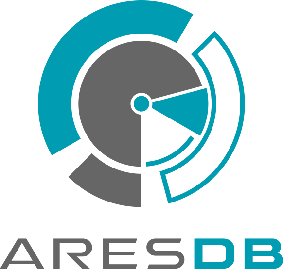

[![Build Status][ci-img]][ci] [![Coverage Status][cov-img]][cov] [](LICENSE) [](https://app.fossa.io/projects/git%2Bgithub.com%2Fuber%2Faresdb?ref=badge_shield)

<p align="center"></p>

AresDB
==============
AresDB is a GPU-based real-time analytics storage and query engine. It features low query latency, high data freshness and highly efficient in-memory and on disk storage management. Please see AresDB's features, architecture design described in the [Uber Engineering Blog](https://eng.uber.com/aresdb/).

This repo contains the source code of AresDB and debug UI.

Legal Note
----------
AresDB requires the CUDA Toolkit. Please ensure you read, acknowledge, and accept the [CUDA End User License Agreement](https://docs.nvidia.com/cuda/eula/index.html).

Getting started
---------------
To get AresDB:

```
git clone git@github.com:uber/aresdb $GOPATH/src/github.com/uber/aresdb
```

NVIDIA Driver and CUDA Setup
----------------------------
AresDB needs [NVIDIA driver](https://www.nvidia.com/Download/index.aspx) version >= 390.48 and [CUDA](https://developer.nvidia.com/cuda-91-download-archive) version 9.1.

Environment Variables
---------------------
Run the following to make sure the following environment variables are correctly set:
```
export PATH=/path/to/cuda/bin:${PATH}
export LD_LIBRARY_PATH=/path/to/cuda/lib64:/path/to/aresdb/lib:${LD_LIBRARY_PATH}
```


Language Requirements
---------------------
Building and running AresDB requires:
* [golang](https://golang.org/) 1.9+
* C++ compiler that support c++11
* [nvcc](https://docs.nvidia.com/cuda/cuda-compiler-driver-nvcc/index.html) version 9.1

Build
-----
The following dependencies need to be installed before building the binary.

### glide
We use [glide](https://glide.sh) to manage Go dependencies. Please make sure `glide` is in your PATH before you attempt to build.

###

Local Test
----------
AresDB is written in C++ (query engine) and Golang (mem store, disk store, disk store and other query components). Because of this, we break testing into two parts:
### Test Golang Code
#### Ginkgo
We use [Ginkgo](https://github.com/onsi/ginkgo) as the test framework for running the Golang unit test and coverage. Install Ginkgo first and run
```
make test
```

### Test C++ Code
#### google-test
We use [google-test](https://github.com/google/googletest) as the test framework to test C++ code. Install google-test and set the environment variable, GTEST_ROOT, to the installed location.

After you have installed properly, run
```
make test-cuda
```

Run AresDB Server
-----------------
The following command will start an AresDB server locally. You can start to query the server using a curl command or [swagger](https://github.com/uber/aresdb/wiki/Swagger) page.
```
make run
```

Run AresDB Docker
-----------------
Please read the [Docker](docs/docker.md) page.

Documentation
--------------

Interested in learning more about AresDB? Read the [blog post](https://eng.uber.com/aresdb/)

License
-------
Apache 2.0 License, please see [LICENSE](LICENSE) for details.

[ci-img]: https://travis-ci.com/uber/aresdb.svg?branch=master
[ci]: https://travis-ci.com/uber/aresdb
[cov-img]: https://codecov.io/gh/uber/aresdb/branch/master/graph/badge.svg
[cov]: https://codecov.io/gh/uber/aresdb

